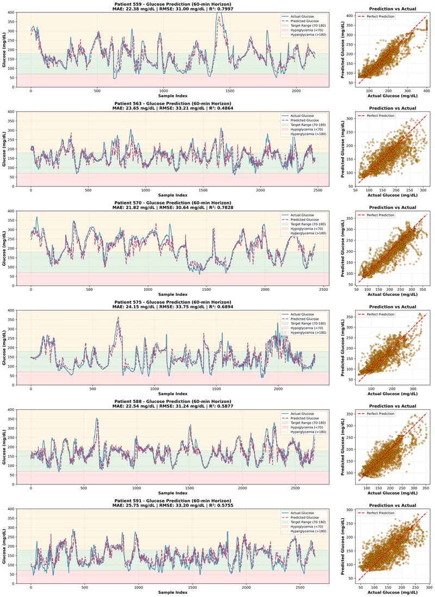
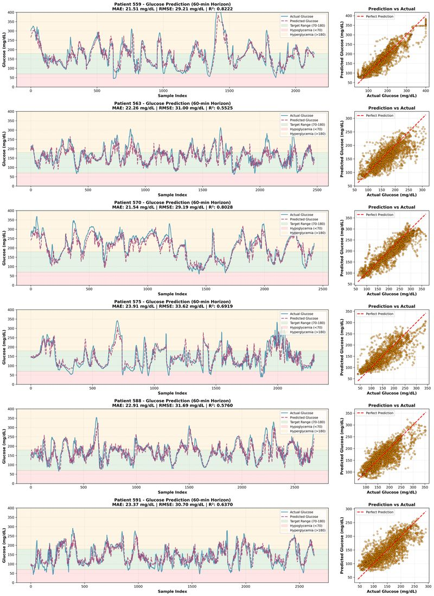
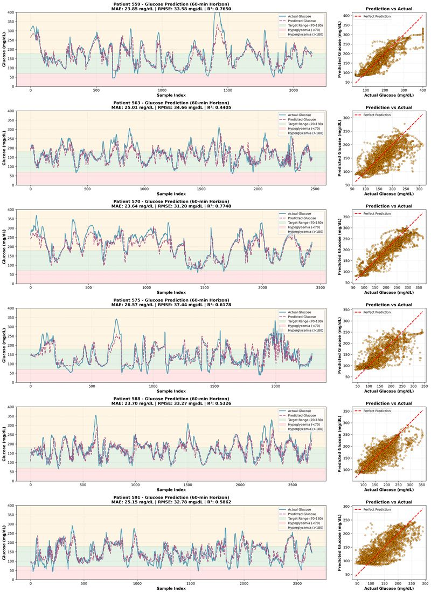
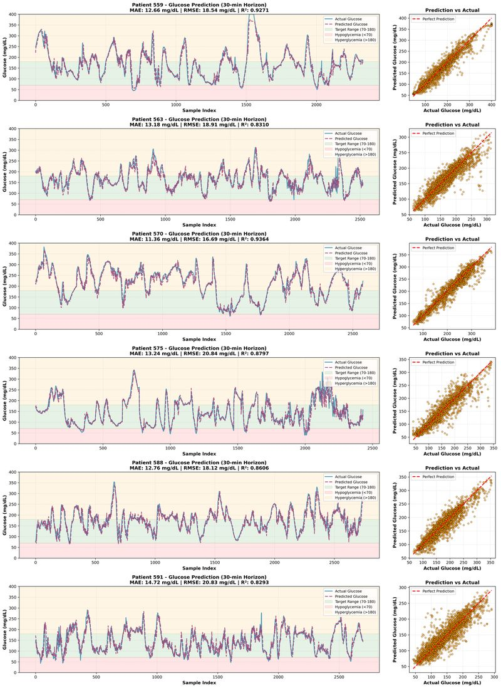
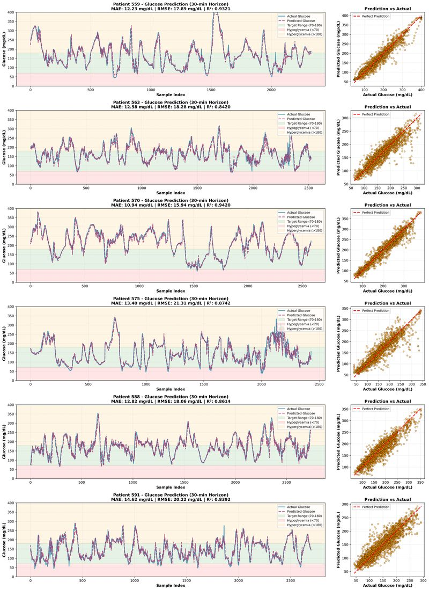
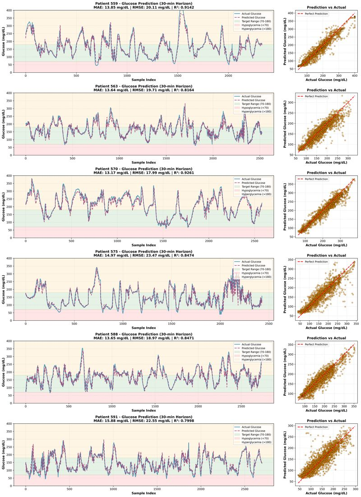
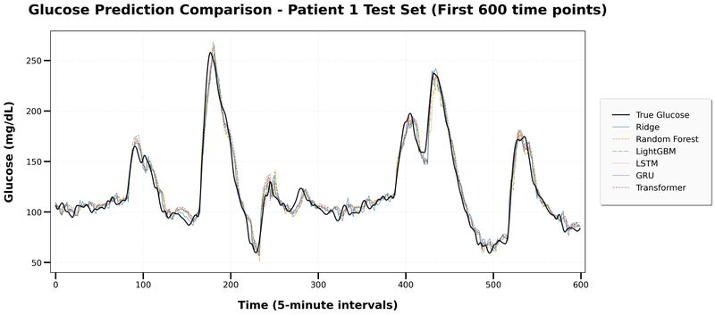
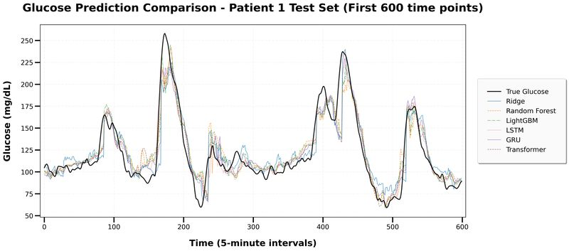

# Short-Term Blood Glucose Prediction with Machine Learning and Deep Learning in Simulated and Real-World Environments

**Author: Zelin Shen** ([GitHub](https://github.com/Zelin-Shen) | [Google Scholar](https://scholar.google.com/citations?user=D6zIduEAAAAJ))

Official code repository for two published papers:

> **Zelin Shen.** *Advancing Short-Term Blood Glucose Prediction through Machine Learning and Deep Learning Models in Simulated and Real-World Environments.* **ISAIMS 2025** (Oral).
> *Awards: **Best Paper Honorable Award**, **Best Oral Presentation**; indexed by **EI** (Engineering Village).*
>
> **Zelin Shen.** *Benchmarking Machine Learning and Deep Learning Models for 60-min Ahead Blood Glucose Prediction in Type 1 Diabetes with Simulated and Clinical Data.* **AIBDF 2025** (Oral).
> *Awards: **Best Paper Honorable Award**, **Excellent Oral Presentation**; indexed by **EI** (Engineering Village).*

This repository implements and compares **machine learning** (Ridge, Random Forest, LightGBM) and **deep learning** (LSTM, GRU, Transformer) models for short-term (30-min and 60-min horizon) blood glucose level (BGL) prediction, evaluated in both **simulated** and **real-world clinical** environments for Type 1 Diabetes management. The 30-min and 60-min experiment suites correspond to the two papers above: the ISAIMS 2025 paper covers the 30-min prediction task, and the AIBDF 2025 paper presents the 60-min benchmark.

## Highlights

- **Two published conference papers** (both single-author), each recognized with a **Best Paper Honorable Award** and **EI indexing**.
- **Dual environments**: experiments on the clinical **OhioT1DM-2018** dataset and **UVa/Padova simulator** data.
- **Dual horizons**: 30-minute and 60-minute prediction tasks.
- **Six models compared** under a unified data preprocessing and evaluation pipeline.
- **Patient-level evaluation**: per-patient detailed prediction curves in addition to aggregate metrics.

## Model Performance (Simulated Environment, 30-min horizon, per-patient RMSE — Patient 1 shown as an example; full tables in `results/`)

| Patient | Ridge | Random Forest | LightGBM | LSTM | GRU | Transformer |
|---|---|---|---|---|---|---|
| 1 | 7.52 | 8.48 | 8.32 | **7.22** | 7.29 | 8.86 |

*See `results/` for complete simulated-environment metric tables (30/60-min) across all patients; real-world experiment metrics are reported in the papers.*

## Repository Structure

```
github-glucose-prediction/
├── notebooks/                      # Experiment notebooks (outputs cleared)
│   ├── data_loading_ohiot1dm.ipynb     # OhioT1DM-2018 XML parsing & feature extraction
│   ├── data_simulation_pytorch.ipynb   # UVa/Padova simulator data handling (PyTorch)
│   ├── real_data_dl_30min.ipynb        # DL models on clinical data, 30-min horizon
│   ├── real_data_dl_60min.ipynb        # DL models on clinical data, 60-min horizon
│   ├── simulated_env_30min.ipynb       # DL models on simulated data, 30-min horizon
│   ├── simulated_env_60min.ipynb       # DL models on simulated data, 60-min horizon
│   ├── ml_ridge_30_60min.ipynb         # Ridge baseline, 30 & 60-min
│   ├── ml_randomforest_30_60min.ipynb  # Random Forest, 30 & 60-min
│   ├── ml_lightgbm_30_60min.ipynb      # LightGBM, 30 & 60-min
│   └── model_visualization_*.ipynb     # Prediction curve plotting
├── models/                         # Trained PyTorch weights (LSTM / GRU / Transformer)
├── results/
│   ├── metrics_summary_simulated_*.csv      # Per-patient RMSE / MAE / R² (simulated)
│   ├── detailed_model_summary_simulated_*.csv
│   ├── experiment_summary_simulated_*.json
│   ├── predictions_simulated_*_patient*.csv # Simulated predictions (30/60-min, 3 virtual patients)
│   ├── predictions_clinical_*.csv           # Clinical ML predictions (Ridge/RF/LightGBM, 30/60-min)
│   └── figures/                             # Prediction curves, 30-min & 60-min, real & simulated
├── data_docs/
│   └── ohiot1dm_reference.txt      # Dataset citations
├── requirements.txt
├── LICENSE
└── README.md
```

## Result Preview

### Clinical data (OhioT1DM) — 60-minute horizon

| LSTM | GRU | Transformer |
|---|---|---|
|  |  |  |

### Clinical data (OhioT1DM) — 30-minute horizon

| LSTM | GRU | Transformer |
|---|---|---|
|  |  |  |

### Simulated environment (UVa/Padova)

| 30-minute horizon | 60-minute horizon |
|---|---|
|  |  |

*Downscaled previews are shown above for fast page loading. Full-resolution figures — including per-patient detail plots for all six clinical patients — are in [`results/figures/`](results/figures/).*

## Datasets

### OhioT1DM-2018 (real-world clinical data)

Blood glucose levels (CGM), insulin doses and life-event annotations of 6 patients (IDs 559, 563, 570, 575, 588, 591), 8 weeks each.

> Marling C, Bunescu R. *The OhioT1DM Dataset for Blood Glucose Level Prediction: Update 2020.* CEUR Workshop Proceedings, Vol-2675, 2020. [PDF](https://ceur-ws.org/Vol-2675/paper11.pdf)

The dataset must be requested from the [BGLP Challenge site](https://sites.google.com/view/kdhd-2018/bglp-challenge) — due to its license, **clinical data files are not included in this repository**.

### UVa/Padova Simulator (simulated environment)

Three virtual adult patients (`adult360_1/2/3`) generated from the UVa/Padova Type 1 Diabetes simulator. Simulator output files are likewise **not redistributed** here; they can be regenerated with the simulator or obtained per its license.

## Environment

```
pip install -r requirements.txt
```

Core dependencies: PyTorch, LightGBM, scikit-learn, pandas, numpy, matplotlib, seaborn, scipy, shap, optuna (see `requirements.txt`).

## Usage

1. Obtain OhioT1DM-2018 from the challenge site and place the XML files under `data/OhioT1DM-2018/Training/` and `data/OhioT1DM-2018/Testing/` (as in the original archive layout). For the simulated experiments, place the UVa/Padova simulator output files (`adult360_1.mat`, `adult360_2.mat`, `adult360_3.mat`) under `data/simulated/`.
2. Run `notebooks/data_loading_ohiot1dm.ipynb` to build the base train/test tables.
3. The ML notebooks (`ml_*`) perform feature engineering in-notebook and expect `train/val/test_enhanced_processed.csv` in the working directory; run the feature-engineering cells of `ml_ridge_30_60min.ipynb` once to export them from the base tables. The DL notebooks (`real_data_dl_*`) consume the base tables directly.
4. Run the model notebooks (`real_data_dl_*`, `ml_*`, `simulated_env_*`).
5. Compare against the shipped metrics in `results/`.

> **Note**: the DL notebooks save/load checkpoints under `save_model/`; the trained weights shipped in this repo live in `models/` — symlink or copy them accordingly if you want to skip retraining.

## Citation

If this work is useful to your research, please cite the paper:

```bibtex
@inproceedings{shen2025advancing,
  title     = {Advancing Short-Term Blood Glucose Prediction through Machine Learning
               and Deep Learning Models in Simulated and Real-World Environments},
  author    = {Shen, Zelin},
  booktitle = {2025 6th International Symposium on Artificial Intelligence for Medical Sciences (ISAIMS)},
  note      = {Best Paper Honorable Award; Best Oral Presentation; EI indexed},
  year      = {2025}
}

@inproceedings{shen2025benchmarking,
  title     = {Benchmarking Machine Learning and Deep Learning Models for 60-min Ahead
               Blood Glucose Prediction in Type 1 Diabetes with Simulated and Clinical Data},
  author    = {Shen, Zelin},
  booktitle = {2025 5th International Symposium on Artificial Intelligence and Big Data (AIBDF)},
  note      = {Best Paper Honorable Award; Excellent Oral Presentation; EI indexed},
  year      = {2025}
}
```

## License

Source code is released under the [MIT License](LICENSE). Datasets referenced above remain under their original licenses.
